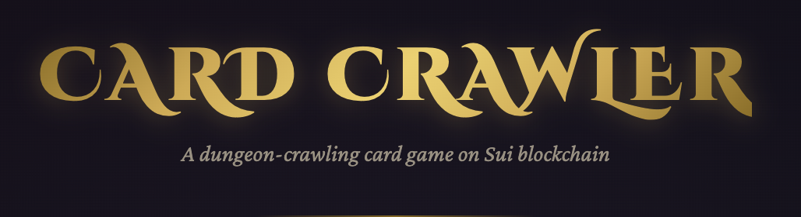

# Card Crawler



A solo roguelike deck-builder built fully on-chain using the **Sui Game Engine**. Inspired by Slay the Spire — fight through 3 floors, build your deck, and defeat the Dragon boss.

> All game logic runs on-chain. Combat turns are **PTB-batched** — draw, play cards, and end turn in a single Sui transaction.

---

## Game Overview

```
Floor 1                    Floor 2                    Floor 3
┌─────────┐                ┌─────────┐                ┌─────────┐
│ Goblin  │──┐             │Skeleton │──┐             │  DRAGON │
│ 20/5    │  │             │ 40/8    │  │             │ 100/15  │
└─────────┘  │             └─────────┘  │             │ +3 ATK  │
             ├── Shop                   ├── Shop      │ per turn│
┌─────────┐  │             ┌─────────┐  │             └─────────┘
│  Slime  │──┘             │Dk Knight│──┘
│  30/4   │                │  60/12  │
│  -or-   │                │  -or-   │
│  Rest   │                │  Orc    │
└─────────┘                │  50/7   │
                           └─────────┘
```

**Win condition**: Defeat the Dragon on Floor 3.

---

## Architecture

### Shared Objects

| Object | Type | Purpose |
|--------|------|---------|
| `World` | Engine world | ECS container for all systems |
| `Entity` | Player entity | Stores Health, Energy, Deck, Gold, Inventory, MapProgress |
| `GameSession` | Game state | Tracks combat, floor, enemies, bonuses, status effects |

### State Machine

```
MAP_SELECT → COMBAT → REWARD → MAP_SELECT → ... → FINISHED
           → SHOP  → MAP_SELECT
           → REST  → MAP_SELECT
```

| State | Value | Description |
|-------|-------|-------------|
| `STATE_LOBBY` | 0 | Reserved |
| `STATE_MAP_SELECT` | 1 | Choose next node on the map |
| `STATE_COMBAT` | 2 | Active combat with an enemy |
| `STATE_REWARD` | 3 | Pick a card reward after combat |
| `STATE_SHOP` | 4 | Buy cards, relics, or remove cards |
| `STATE_REST` | 5 | Heal 30% max HP |
| `STATE_FINISHED` | 6 | Game over (won or died) |

---

## Entry Functions

### Game Setup

#### `create_and_start(clock: &Clock, ctx: &mut TxContext)`

Creates all shared objects and initializes the player:

- **World** — ECS container (max 100 entities)
- **Player Entity** — 80 HP, 3 Energy (regen 3), 10-card starter deck, 50 Gold, 3-slot Inventory
- **GameSession** — Starts at Floor 1, MAP_SELECT state

**Starter Deck**: 5× Strike (6 dmg, cost 1) · 4× Defend (5 block, cost 1) · 1× Bash (10 dmg, cost 2)

---

### Map Navigation

#### `choose_node(session, path, ctx)`

Selects the next node on the current floor. The `path` parameter (0 or 1) resolves branching nodes.

| Floor | Node 0 | Node 1 (path 0 / 1) | Node 2 |
|-------|--------|---------------------|--------|
| 1 | Goblin (20/5) | Slime (30/4) / Rest | Shop |
| 2 | Skeleton (40/8) | Dark Knight (60/12) / Orc (50/7) | Shop |
| 3 | Dragon (100/15) | — | — |

#### `advance_floor(session, ctx)`

Move to the next floor after clearing all nodes. Fails with `EFloorNotCleared` if nodes remain.

---

### Combat (PTB-Batched)

A typical combat turn is **one Sui transaction** with these calls chained:

```
1. draw_phase(world, session, player)
2. play_card(world, session, player, 0)     // repeat as energy allows
3. play_card(world, session, player, 0)
4. end_player_turn(world, session, player, random, ctx)
```

#### `draw_phase(world, session, player)`

- Resets block to 0
- Regenerates energy to max
- Draws 5 cards (+ Fury bonus)

#### `play_card(world, session, player, hand_index)`

Plays a card from hand. The engine:
1. Checks energy ≥ card cost (aborts if insufficient)
2. Spends energy
3. Removes card from hand → discard
4. Returns `CardData` for effect processing

#### `end_player_turn(world, session, player, random, ctx)`

1. Discards remaining hand
2. Ticks poison on enemy (decrements stacks)
3. Ticks regen on player
4. Enemy attacks (reduced by block → DEF bonus → weaken)
5. Thorns damage back if player was hit
6. Checks win/loss conditions
7. Shuffles deck if combat ends

---

### Rewards

#### `collect_reward(session, player, card_choice, ctx)`

After combat victory, pick 1 of 3 card rewards (or pass with `card_choice = 3`).

| Floor | Choice 0 | Choice 1 | Choice 2 |
|-------|----------|----------|----------|
| 1 | Heavy Blow (14 dmg) | Poison Stab (4+3 poison) | Heal (8 HP) |
| 2 | Execute (10/25 dmg) | Shield Wall (12 block) | Berserk (+3 ATK) |

---

### Shop

#### `shop_action(session, player, item_type, item_id, ctx)`

| item_type | Action | Cost | item_id |
|-----------|--------|------|---------|
| 0 | Buy card | 60 gold | Card index 0–14 |
| 1 | Remove card | 50 gold | Draw pile index |
| 2 | Buy relic | 100 gold | Relic type 0–5 |

#### `shop_done(session, ctx)`

Leave the shop, advancing `nodes_cleared`.

**Shop Card Pool** (15 cards):

| Index | Card | Cost | Type | Effect |
|-------|------|------|------|--------|
| 0 | Heavy Blow | 2 | ATK | 14 damage |
| 1 | Poison Stab | 1 | ATK | 4 dmg + 3 poison |
| 2 | Whirlwind | 1 | ATK | 5 damage |
| 3 | Rampage | 1 | ATK | 8 + 4×count |
| 4 | Execute | 2 | ATK | 10 (or 25 if enemy <30% HP) |
| 5 | Shield Wall | 2 | SKL | 12 block |
| 6 | Heal | 1 | SKL | 8 HP |
| 7 | Dodge | 0 | SKL | 3 block (free) |
| 8 | Weaken | 1 | SKL | -3 enemy ATK, 2 turns |
| 9 | Adrenaline | 0 | SKL | Draw 2 + gain 1 energy |
| 10 | Berserk | 2 | PWR | +3 ATK permanent |
| 11 | Iron Skin | 2 | PWR | +3 DEF permanent |
| 12 | Regeneration | 2 | PWR | +2 HP/turn |
| 13 | Thorns | 1 | PWR | 3 dmg to attacker |
| 14 | Fury | 2 | PWR | +1 card drawn/turn |

---

### Rest

#### `rest(session, player, ctx)`

Heals **30% of max HP**. Only available at rest nodes.

---

## Relics

Relics are stored in the player's `Inventory` component (max 3 slots). Purchased at shops for 100 gold.

| Type | Name | Effect | When Applied |
|------|------|--------|--------------|
| 0 | Whetstone | +2 ATK to all attacks | Each attack card |
| 1 | Iron Ring | +2 DEF (reduces incoming) | On acquire (permanent) |
| 2 | Energy Potion | +1 max energy per turn | On acquire (permanent) |
| 3 | Healing Crystal | +5 HP after each combat | Combat victory |
| 4 | Lucky Coin | +15 gold from combat | Combat victory |
| 5 | Thick Skin | +10 max HP (+10 current) | On acquire (permanent) |

---

## Enemy Scaling

| Enemy | HP | ATK | Special |
|-------|----|-----|---------|
| Goblin | 20 | 5 | — |
| Slime | 30 | 4 | — |
| Skeleton | 40 | 8 | — |
| Orc | 50 | 7 | — |
| Dark Knight | 60 | 12 | +2 ATK every 3 turns |
| Dragon (Boss) | 100 | 15 | +3 ATK every turn |

**Gold rewards**: Floor 1 combat = 22, Floor 2 combat = 32, Elite = 50, Boss = 0 (victory is the reward).

---

## Engine Components Used

| Component | Module | What It Stores |
|-----------|--------|---------------|
| `Health` | `components::health` | `current: u64`, `max: u64` |
| `Energy` | `components::energy` | `current: u8`, `max: u8`, `regen: u8` |
| `Deck` | `components::deck` | `draw_pile`, `hand`, `discard` (vectors of `CardData`) |
| `Gold` | `components::gold` | `amount: u64` |
| `Inventory` | `components::inventory` | `items: vector<ItemData>`, `capacity: u64` |
| `MapProgress` | `components::map_progress` | `current_floor: u8`, `current_node: u8` |

### CardData Schema

```
CardData {
    name: String,       // e.g. "Strike"
    cost: u8,           // energy cost
    card_type: u8,      // 0=Attack, 1=Skill, 2=Power
    effect_type: u8,    // effect identifier (unique per card_type)
    value: u64,         // effect magnitude
}
```

---

## Events

| Event | Fields | Emitted When |
|-------|--------|-------------|
| `RunStarted` | session_id, player | Game created |
| `NodeChosen` | session_id, floor, node, node_type | Map node selected |
| `CombatStarted` | session_id, enemy_hp, enemy_atk, enemy_type | Combat begins |
| `CardEffect` | session_id, card_type, effect_type, value | Card played |
| `TurnEnded` | session_id, player_hp, enemy_hp, turn | Turn resolved |
| `CombatWon` | session_id, gold_reward, floor | Enemy defeated |
| `PlayerDied` | session_id, floor, turn | Player HP reaches 0 |
| `GameWon` | session_id, player | Dragon defeated |
| `FloorAdvanced` | session_id, new_floor | Moved to next floor |

---

## Error Codes

| Code | Name | Cause |
|------|------|-------|
| 100 | `EWrongState` | Action not valid in current state |
| 101 | `ENotPlayer` | Caller is not the session owner |
| 102 | `EInvalidNode` | Invalid node selection |
| 103 | `EInvalidCardChoice` | Card index out of bounds |
| 104 | `EInvalidItemType` | Unknown shop action type |
| 105 | `ECombatNotOver` | Combat still in progress |
| 106 | `EGameAlreadyStarted` | Duplicate start attempt |
| 107 | `EFloorNotCleared` | Not all nodes cleared on floor |
| 108 | `EMaxRelics` | Inventory is full (3 relics) |

---

## Read-Only Getters

For frontend state reading:

```
state(s)          → u8      // current game state
player(s)         → address // session owner
floor(s)          → u8      // current floor (1-3)
enemy_hp(s)       → u64     // current enemy HP
enemy_atk(s)      → u64     // current enemy ATK
block(s)          → u64     // player block this turn
atk_bonus(s)      → u64     // permanent ATK bonus
def_bonus(s)      → u64     // permanent DEF bonus
won(s)            → bool    // true if Dragon defeated
nodes_cleared(s)  → u8      // nodes done on current floor
nodes_total(s)    → u8      // total nodes on current floor
```

---

## Testing

```
sui move test
```

```
[ PASS ] test_start_run
[ PASS ] test_choose_combat_and_draw
[ PASS ] test_play_card
[ PASS ] test_full_combat_turn
[ PASS ] test_kill_enemy_reward
[ PASS ] test_rest_heals
[ PASS ] test_advance_floor
[ PASS ] test_energy_gate
[ PASS ] test_block_reduces_damage
[ PASS ] test_wrong_state
Test result: OK. Total tests: 10; passed: 10; failed: 0
```

---

## Build & Deploy

```bash
# Build
sui move build

# Test
sui move test

# Deploy to testnet
sui client publish --gas-budget 500000000
```
